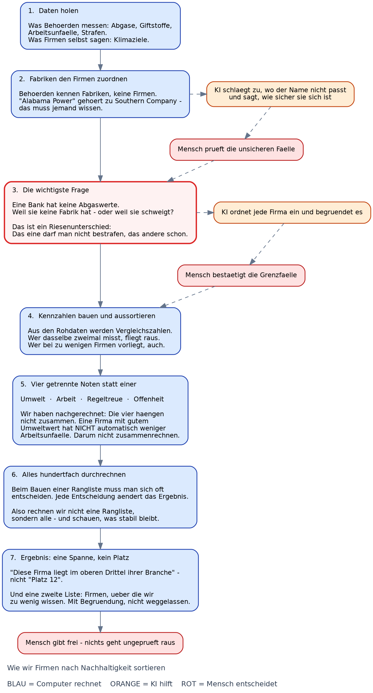

# ETHack — S&P-500-Nachhaltigkeitsranking (Clean Framework v1)

> **In einem Satz:** Von 500 Firmen sind 500 im Datensatz, 467 mit mindestens einem
> Nachhaltigkeitswert, 143 mit Klimarangband — und 378 mit geprüfter
> wirtschaftlicher Tragfähigkeit. Das Ranking sagt nicht „wer ist nachhaltig“,
> sondern „wer betreibt große Schornsteine, wie effizient — und kann die Firma
> ihre Belegschaft auch im schlechten Jahr bezahlen?“

Branch: `clean/sustainability-framework-v1` — vereinigt `dataset` (c9d58f2)
mit `feat/economy` (1171a10). Bewusst **nicht** übernommen: `feat/sustainability-observatory`
(eigener WBA-JS-Stack), `worktree-peer-groups` (18er-Raster, als Limitation dokumentiert).



## 1. Schnellstart — ich habe Daten, was tun?

```bash
python3 -m venv .venv && .venv/bin/pip install pandas numpy matplotlib scipy requests rapidfuzz pyarrow lxml

# Kern (ohne Keys, ~4 min + ~90 s):
.venv/bin/python scripts/01_fetch.py
.venv/bin/python scripts/02_analyse.py
.venv/bin/python scripts/03_grafiken.py

# Erweitert (braucht Keys / mehr Zeit):
.venv/bin/python scripts/05_neue_dimensionen.py   # OSHA, TRI, ECHO, eGRID
.venv/bin/python scripts/07_dataset.py            # dataset_long.csv/parquet + Web-JSON
.venv/bin/python scripts/09_belastbarkeit.py      # E/S/G-Belastbarkeit
.venv/bin/python scripts/10_pruefung.py           # Qualitätsprüfung + KI-Gutachten
.venv/bin/python scripts/11_economy.py fetch data/raw/sec_facts  # SEC companyfacts
.venv/bin/python scripts/11_economy.py score data/raw/sec_facts  # economic_viability.csv

# Browser (nutzt vorbereitete Daten, keine Live-Behördenabfrage):
cd web && npm ci && npm run dev  # -> http://localhost:3000
```

Gespeicherte Ergebnisse ansehen ohne Rechnen: `data/out/*.csv|json`,
`web/public/data/` (generiert), `report/*.pdf`.

## 2. Die Idee in 6 Sätzen (ohne Statistik)

1. **Keine gekauften Noten.** Wir messen wenige physische Größen selbst (CO₂,
   Unfälle, Schadstoffe, Verstöße), statt ESG-Scores zu kaufen.
2. **Nur innerhalb der Branche.** Ein Versorger stößt pro Umsatz-Dollar ~100×
   mehr aus als ein Softwarehaus — also Sektor/Sub-Industry als Vergleichsgruppe.
3. **Schwachstelle zählt.** Geometrisches Mittel: ein katastrophaler CO₂-Wert
   lässt sich nicht durch gute Nebenwerte „zurückkaufen“.
4. **Band statt Platz.** 1500 Zufallsdurchläufe über 576 Methodenkombinationen
   (Skalierung × Gewichtung × Zusammenfassung × Gruppe × Extremwert-Regel) →
   Perzentilband P10–P90, kein Schein-Platz „#42“.
5. **Greenwashing extra.** Intensitäts-Illusion + bequemes Basisjahr stehen
   daneben, werden nie mit Leistung verrechnet.
6. **Kann die Firma weitermachen?** Neu: Economic Viability aus SEC-Filings —
   Cash-Erwirtschaftung + Schockpuffer (eigenes schlimmstes Jahr wiederholt)
   + Schuldendienst. Sättigend („genug ist genug“), schwächstes Glied entscheidet.
   Banken/Versicherer = not assessable.

Das ist bewusst einfach erzählt. Die volle Strenge steht in
`report/analyse_ranking.tex`, `report/datenluecke.tex`,
`report/qualitaetspruefung.tex`, `report/fusionsbericht.tex`,
`report/economic_viability.tex` und `docs/COMPARISON.md`.

## 3. Aufbau

```
pipeline/
  sources/base.py       Plug-in-Grenze: DataSource + Registry + Parquet-Cache
  sources/sp500.py, sec_revenue.py, epa_ghgrp.py, epa_campd.py, epa_tri.py,
          epa_echo.py, egrid.py, eia_*.py, osha_ita.py, dol_whd.py,
          sbti.py, team.py, esg_snapshot.py (nur Vergleichsmaßstab)
  resolve.py            Anlage → Konzern → Ticker (exakt/Override/fuzzy, Schwelle 92)
  canonical.py          eine Zeile je Firma×Jahr, Herkunft je Feld
  scoring/normalize.py  rang | z-getrimmt | min-max | median-mad
  scoring/weight.py     gleich | Entropie | CRITIC
  scoring/aggregate.py  geometrisch (default) | additiv
  scoring/montecarlo.py Unsicherheit → Rangband
  quality.py            F01–F13+P01–P02: fehler (nicht rechnen) vs pruefen (Beleg nötig)
  reliability.py        E/S/G-Belastbarkeit (≥2 Familien + Anker ≥0.8 + Summe ≥1.5)
  ai_review.py, flag_apply.py, consolidate.py, analysis.py, figures.py
  economy/              fetch_sec_facts.py + financial_health.py (Helfer) + economic_viability.py
scripts/ 01_fetch → 02_analyse → 03_grafiken → 04_datenluecke → 05_neue_dimensionen
         → 05b_firmenaggregate → 06_katalog → 07_dataset → 08_logos
         → 09_belastbarkeit → 10_pruefung → 11_economy (neu)
data/out/  alle Ergebnisse als CSV + json (dataset_long, rangbaender, belastbarkeit,
           flags, economic_viability.csv, katalog_stats.json, ...)
report/    LaTeX-Quellen + PDFs + figures/
web/       Next.js-Browser (Firmen, Vergleich, Belastbarkeit, Prüfung, Downloads)
docs/COMPARISON.md  Abgrenzung zu kommerziellen Rankings, Verbesserungen, Limitationen
```

**Erweitern (3 Zeilen):**
- Neue Quelle: von `DataSource` erben, `_fetch()` + `@register` — Stufen danach unverändert.
- Neue Kennzahl: Spalte in `canonical.py` + `Metric(...)` in `02_analyse.py` (`direction=-1` = kleiner besser).
- Neue Methode: Funktion in `normalize/weight/aggregate.py` registrieren — Monte-Carlo nimmt sie automatisch auf.

## 4. Datenlage (selbst geprüft, Stand 09/2026)

| Quelle | Zugang | Bringt / Grenze |
|---|---|---|
| EPA GHGRP (Envirofacts) | REST ohne Login | Scope-1 je Anlage, endet **2023**; `sector_type` trennen (Direkt vs. Supplier vs. Injektion), biogen auslassen — sonst Faktor-3-Fehler |
| SEC XBRL frames + companyfacts | REST, User-Agent | Umsatz bis FY2025; Viability FY2016–2026, 420 TTM ≥06/2026 |
| EPA CAMPD (CEMS) | kostenloser Key `EPA_CAMD_API_KEY` | Kraftwerks-CO₂ bis **2026**, Owner vs. Operator getrennt — schließt Strom-Lücke |
| PUDL Zenodo / Exhibit-21 | frei | CEMS-Spiegel + 916k Töchter (478/500 Mütter) — ersetzt OVERRIDES |
| SBTi-Excel | frei (kein API, 404) | 241 Firmen Zielstatus, 50 zurückgezogen |
| OSHA ITA, TRI, ECHO, eGRID, DOL-WHD, EIA | frei / EIA-Key nachrangig | OSHA 323, TRI 205, ECHO 138, eGRID 48 Firmen; Union 339 (+192 neu) → 349 bewertbar (69 %) |
| Kommerziell (esg_snapshot) | nur Benchmark | fließt **nie** in Note ein; Spearman-Vergleich in `analysis.py` |
| Sackgassen | geprüft | CDP (nur Städte), iShares (nur Fonds), TPI (Scraping-Verbot), TRACE Owners leer |

Nur `EPA CAM API` (wichtig) + `EIA` (nachrangig) brauchen Accounts, beide kostenlos.

## 5. Ergebnis + Vergleich + Limitationen (Kurzfassung)

- **Abdeckung:** 503 Einträge, 45 Kennzahlen, ~11,4k Werte, 19 Quellen (14 liefernd).
  Klimaband nur 143 Firmen — fast nur Schwerindustrie, weil Tech/Finanzen in
  Scope 2/3 liegen (keine freien Firmendaten). Median-Bandbreite ~33–34 Punkte.
- **Viability:** 378 viable / 29 strained / 19 at-risk / 77 NA. Korrelation mit
  Größe ρ=0,03, mit Marge ρ=0,12 — kein Profit-Proxy (Intel-Verlust vs. Cash als Test).
- **Qualität:** 382 Flags (239 fehler, 143 pruefen) → nach Reparatur 10 + Grenzfälle;
  E/S/G-Belastbarkeit mit Beweisgewichten (gemessen 1,0 → Status 0,2).
- **Vs. MSCI/Sustainalytics/ISS:** keine gekauften Scores, keine additive
  Kompensation, kein exakter Rang, Greenwashing separat, jede Zahl mit Quelle +
  Unsicherheitsband. Details, Verbesserungen (Faktor-3-Fix, Staleness-Backtest
  Spearman 0,84 aber 37 % >10pp-Shift, Entkorrelierung) und ehrliche Limitationen
  (EPA-Lag, nur 143 Bänder, 36 ohne Wert, kein Scope 3, keine Historie der
  S&P-Liste, Peer-Raster nur GICS) → **`docs/COMPARISON.md`**.

## 6. Was bewusst fehlt / alt ist

- `data/out/ai_review_cache/`, `web/public/logos/`, `web/public/data/` = generiert
  (siehe `.gitignore`), Logos via `08_logos.py` regenerierbar.
- `fusionsbericht (1).pdf` (altes f01–f07-Modell) aus clean entfernt (Historie behält es).
- `feat/sustainability-observatory` (WBA-JS-App) und `worktree-peer-groups`
  (18er-Raster) nicht gemergt — Ideen in COMPARISON referenziert.
- `financial_health.py` bleibt nur als Helfer + dokumentierter Irrweg (Versuch 1);
  gültig ist `economic_viability.py` (Versuch 4).

PDF bauen: `tectonic --untrusted --outdir report report/fusionsbericht.tex`
→ `pdfinfo`, `pdftoppm -scale-to 1200 -png` prüfen (Warnungen: Glyphen/Refs/Boxen).
