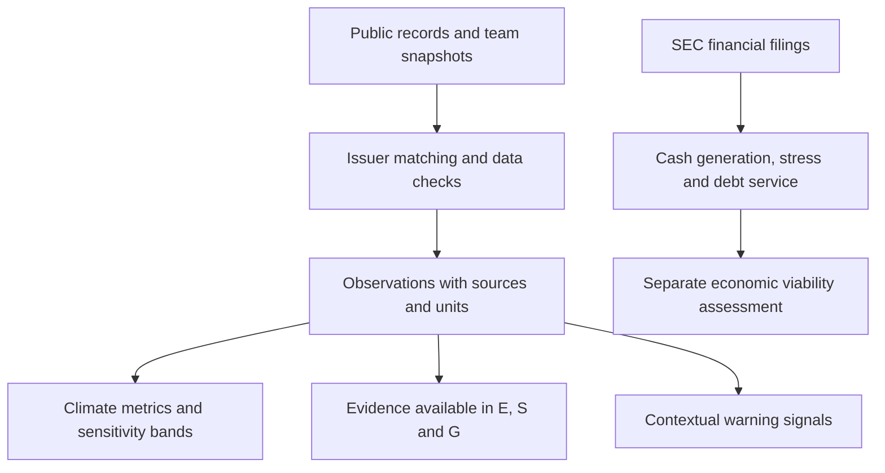

# Understanding the framework

> **Dashboard 2:** [Open the dashboard](../dashboard.html). Ali’s supplied four-axis snapshot retains 503 securities, including share classes; 147 meet its comparison threshold and 129 have all four axes. Its one-year viability reconstruction and portfolio illustrations are separate from the reproducible climate/evidence/historical-viability pipeline documented here. The generating code was absent from main commit `b0692c4`; cleanup preserves all 22,050 numeric and boolean values rather than inventing a rebuild. Missing records are labeled as coverage gaps, and percentile ranges are not treated as confidence intervals.

We built this framework to make a company's sustainability evidence easier to inspect and harder to hide behind one attractive score. It brings together public records, checks who those records actually belong to, and shows how the conclusion changes when reasonable scoring choices change.

The result has four parts: **operational climate performance, the strength of the available evidence, contextual warning signals, and economic viability**. Keeping these separate makes the result easier to explain. A company can be financially viable, have poor emissions performance, and still have too little social evidence for a confident assessment.

## Why build another approach?

Existing ESG ratings are useful, but they answer different questions and can disagree. Berg, Kölbel, and Rigobon studied six rating providers and found that differences in measurement and coverage explained more disagreement than differences in weights. That motivates our emphasis on showing the observations and their boundaries, rather than simply proposing another set of weights. Their paper supports that design choice; it does not validate our particular framework. [*Aggregate Confusion*, 2022](https://doi.org/10.1093/rof/rfac033).

It is also important to compare fairly. MSCI already uses industry-relative ratings and describes its purpose in terms of resilience to financially material ESG risks. Sustainalytics measures unmanaged ESG risk. Neither should be described as a universal measurement of a company's harm to the planet. Our question is narrower: **what do the available operational records show, and how stable is our interpretation?** [MSCI methodology](https://www.msci.com/downloads/web/msci-com/legal/sustainability-and-climate-resources-and-disclosures/MSCI%20ESG%20Ratings%20Methodology.pdf), [Sustainalytics ESG Risk Ratings](https://www.sustainalytics.com/esg-data).

## Follow one company through the framework

**1. Start with records that can be traced.** The inputs include EPA emissions, toxic releases and enforcement records; OSHA workplace reports; wage enforcement cases; SEC financial filings; and target or disclosure assessments from SBTi and WBA. A reported number, an official finding, and an assessment of company disclosures are different kinds of evidence. The dataset identifies their sources and units.

**2. Establish which company the records belong to.** A power plant may report under a subsidiary's name. A branded store may be operated by an independent employer. An acquisition may have happened after the year being measured. These are not minor spelling problems: a wrong match can give one company another company's emissions or violations. Our resolver uses cleaned names, subsidiary mappings, selected ownership periods, and matching-confidence indicators.

**3. Compare climate performance among peers.** The climate analysis examines emissions per dollar of revenue, the change in that intensity, and the change in absolute emissions. Sector and sub-industry comparisons reduce obvious business-model differences. Research on materiality supports paying attention to industry context, although it does not prove that our GICS groups or three climate metrics are sufficient. [Khan, Serafeim, and Yoon, 2016](https://doi.org/10.2308/accr-51383).

Consider an invented example: emissions rise from 100 to 110 tonnes while revenue rises from 100 to 125 units. Emissions per revenue unit fall from 1.00 to 0.88: a 12% improvement in intensity alongside a 10% increase in emissions. Looking at both makes the trade-off visible. It does not establish deceptive intent.

**4. Test the scoring choices.** We vary normalization, weights, aggregation, peer groups, extreme-value treatment, and selected missing-metric scenarios. We also test assumed noise related to attribution confidence. The main configured run uses 1,500 draws and reports the 10th, 50th, and 90th percentiles of the resulting peer positions.

A hypothetical band from 35 to 75 means the company's relative position changes substantially across the sampled choices. It does **not** mean an 80% probability that the company is sustainable. This use of uncertainty and sensitivity analysis follows established composite-indicator research. [Saisana, Saltelli, and Tarantola, 2005](https://doi.org/10.1111/j.1467-985X.2005.00350.x).

**5. Keep weak points visible.** With two normalized scores of 1.00 and 0.01, an equal-weight arithmetic mean is 0.505, while the geometric mean is 0.10. The geometric version penalizes an uneven profile more strongly. We include both in the sensitivity analysis rather than claiming one aggregation rule is objectively correct. Within the economic assessment, the weakest available dimension determines the category.

**6. Ask whether the company can keep funding its operations.** The economic model examines cash generation, the ability to absorb a repeat of a historical cash-flow decline, and debt-service capacity. Its scores stop increasing once the chosen sufficiency thresholds are met. This avoids rewarding unlimited profit or company size by construction, although it does not prove the result is free of bias. It is a screening model, not a bankruptcy or payroll guarantee.

## Where the design effort went

The substantial work is in connecting and checking evidence, not just calculating an average. The retained code includes fixes for several concrete failure mechanisms:

| Problem | Design response |
|---|---|
| Supplier fuel quantities mixed with a facility's own emissions | Separate GHGRP reporting categories before aggregation |
| Zero in a program that does not measure CO2 | Check the reporting program; do not interpret that zero as clean operation |
| Repeated facility joins multiplying violation histories | Deduplicate facility/company links and enforce the twelve-quarter limit |
| Unrelated names matching through a short prefix | Require word boundaries and use conservative matching for workplace and wage records |
| Corporate changes applied to earlier reporting years | Add selected ownership validity windows |
| Multiple share classes duplicating company totals | Identify issuers by CIK and use one primary ticker |
| Ratios presented as if the source reported them | Keep source quantities separate from calculated intensities, trends, and rankings |
| Review decisions moving to another case after reordering | Bind finding IDs to their content and supporting evidence |

The evidence assessment also groups related metrics into families. Several emissions measures do not count as several independent demonstrations of sustainability. The resulting labels describe the evidence available under our rules; they are not ratings of company behavior.

## In what sense is this better?

For **auditing a result and understanding its sensitivity**, this framework offers practical advantages over consuming a single top-line ESG score: accessible code, a traceable observation table, visible modeling alternatives, explicit gaps, and a separation between performance, commitments, and financial capacity.

These strengths are a combination of established statistical ideas and project-specific data engineering. We have not demonstrated that the framework predicts sustainability outcomes better than commercial providers, and industry comparison or geometric aggregation are not inventions of this project. The OECD/JRC handbook provides the broader methodological foundation for examining composite indicators critically. [*Handbook on Constructing Composite Indicators*, 2008](https://doi.org/10.1787/9789264043466-en).

The main limitation is coverage. The snapshot has 500 issuers with some data, but only 449 with sustainability-related observations and 127 with a saved climate band. US facility records miss much of global operations and Scope 2 and 3. Revenue is global, while the emissions numerator covers only matched US facilities. Small peer groups can produce impressive-looking percentiles with little comparative information. The Financials sector is excluded from the economic model, and evidence quality remains uneven.

Use the framework to ask better, verifiable questions about a company. A favorable relative result alone does not establish that its activities meet an absolute sustainability standard. The [technical explanation](TECHNICAL.md) sets out exactly what is calculated and what remains unvalidated.
