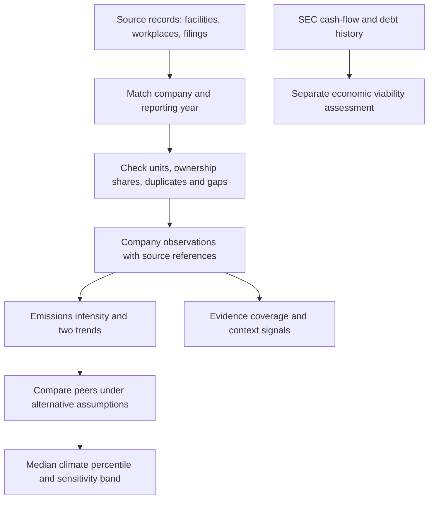

# From a factory record to a company assessment

**We start with evidence about what companies do, establish which company each record belongs to, and compare the resulting measures with peers. Then we repeat the calculation under different assumptions to see how much the answer moves.**

The difficult work comes before the score: identifying subsidiaries, assigning facilities to the right owner and year, reconciling units, avoiding duplicate records, and distinguishing missing data from zero impact. This walkthrough follows one fictional company through that process. **Every number in the worked example is illustrative.**

## 1. Collect records: what do we actually know?

A factory reports emissions. A workplace reports injuries. A regulator records a violation. A company files its revenue and cash flow. These records describe different things, so we preserve their source, reporting period, and unit.

| Question | Data we use | What it tells us |
|---|---|---|
| What is emitted? | EPA GHGRP; power-sector CAMPD and eGRID records | Reported or calculated emissions, and power-sector monitoring data |
| What happens at workplaces? | OSHA injury reports; DOL wage enforcement records | Recorded injuries, fatalities, wage cases, and back wages |
| What environmental problems are recorded? | EPA TRI and ECHO | Toxic releases and regulatory compliance records |
| What has the company committed to or disclosed? | SBTi and WBA | Target status and assessments of published information |
| How large is the business, and can it fund its operations? | SEC financial filings | Revenue, operating cash flow, investment, debt, and interest |

These sources do not form a complete worldwide footprint. Their coverage differs, and several emissions datasets describe the same facilities. **We do not add overlapping source totals together.** The reproducible climate calculation uses GHGRP emissions and SEC revenue; the other records provide additional evidence and context.

## 2. Match the record: whose factory is it?

A facility may report as “Example Manufacturing LLC,” while its listed parent is “Example Group.” Before counting its emissions, we need to connect those identities.

The main emissions resolver works through increasingly uncertain matches:

1. **Normalize the name and look for an exact match.** Differences in punctuation or legal suffixes should not create different companies.
2. **Check known subsidiaries and controlled name prefixes.** A subsidiary can belong to a parent with a completely different name. Prefixes must end at word boundaries to avoid matching unrelated names.
3. **Try name similarity if the earlier checks fail.** The GHGRP fallback requires a similarity score of at least 92 out of 100. Workplace and wage matching use more conservative rules without this fallback.
4. **Check the reporting year against selected ownership periods.** A later acquisition should not automatically transfer earlier emissions to the new owner.

We retain the matching method and a confidence indicator. **A similarity score of 92 is not a 92% probability that the owner is correct.** It is a name-comparison score. Unmatched records remain outside the attributed company total; they do not turn into zero emissions.

## 3. Build the company total: how much belongs to it?

For GHGRP, we multiply each facility’s emissions by the assigned ownership share, then add the contributions for the company and reporting year.

| Facility | Reported emissions | Company share | Attributed emissions |
|---|---:|---:|---:|
| Factory A | 100,000 t CO2e | 100% | 100,000 t CO2e |
| Factory B | 200,000 t CO2e | 50% | 100,000 t CO2e |
| **Company total** | | | **200,000 t CO2e** |

When ownership shares are absent, the parser allocates the remaining share equally among the named owners. That is an explicit assumption. Other source connectors use different attribution rules; the [technical guide](TECHNICAL.md#3-facility-attribution-and-observation-construction) explains them.

We also measure how much of the source data we managed to assign. If the source contains 10 million tonnes and we attribute 5.3 million to the study companies, the **attributed share is 53%**. This describes coverage of that source, not coverage of every company’s global footprint and not a sustainability score.

## 4. Turn totals into comparable questions

A large business will often emit more than a small one. We therefore examine three climate measures together:

| Measure | Question |
|---|---|
| Emissions per USD million of revenue | How emissions-intensive is the observed business activity? |
| Change in emissions intensity | Is that intensity improving over time? |
| Change in absolute emissions | Are the actual attributed tonnes falling? |

For our example, 200,000 tonnes divided by USD 1,000 million of revenue gives **200 tonnes per USD million**. We compare this with companies in the same sector or, where enough observations exist, sub-industry.

Why retain absolute emissions? If emissions rise 10% while revenue rises 25%, intensity improves 12% even though more is emitted. Both statements matter. For the actual trend measures, the model fits multiple years of data rather than relying on this simple two-year illustration.

The comparison still has a boundary problem: matched US facility emissions are divided by company revenue that may be global. The result is a partial operational measure, not a complete carbon footprint.

## 5. Repeat the calculation: does the conclusion hold?

The indicators have different units. To combine them, we must choose how to put them on a common scale, how much weight each receives, and whether strong performance can compensate for a weak measure.

We test alternative choices instead of hiding them:

- Compare by sector or sub-industry.
- Use different ways of scaling and weighting the three measures.
- Change the treatment of extreme values and sometimes omit one measure.
- Compare arithmetic and geometric aggregation; the geometric version penalizes an uneven profile more strongly.
- Perturb inputs using an assumed noise rule that increases as matching confidence decreases.

The configured main run samples **1,500 combinations of choices and input perturbations**. Each run produces a company percentile within its peer group. Higher percentiles mean better relative performance under that run’s assumptions.

Suppose the resulting 10th, 50th, and 90th percentiles are **18, 26, and 40**. We show a median of 26 and a band from 18 to 40. A wide band means the modeled choices matter; a narrow band means less movement in those scenarios. Very small peer groups can also create deceptively narrow bands.

**The band describes variation in the calculated peer position.** It is not an emissions error bar, a probability that the company is sustainable, or a statistical confidence interval. Separate runs vary only the scoring methods or only the assumed input noise to help explain the movement. Those diagnostics are not an additive decomposition of uncertainty.

## 6. Read the result alongside the remaining evidence

The reproducible pipeline gives us several distinct answers:

| Output | How to read it |
|---|---|
| Climate band | Relative operational climate performance and its sensitivity to modeled choices |
| E, S, and G evidence labels | How much relevant evidence is available under our coverage rules |
| Context signals | Patterns worth inspecting, such as falling intensity alongside rising emissions |
| Economic viability | Whether cash generation, historical stress capacity, and debt service meet chosen sufficiency thresholds |

Several related emissions measures do not count as independent evidence families. Missing workplace records do not prove that a company has no injuries. A context flag does not establish deception. Financial capacity is assessed separately, and its component scores stop improving once “enough” is reached.

## How this connects to Dashboard 2

[Dashboard 2](../dashboard.html) presents four axes—environment, social, regulatory compliance, and disclosure/targets—alongside provisional viability. It lets readers inspect companies, compare ranges, explore gaps, and view a portfolio illustration.

Its embedded results are a **separate supplied snapshot**. It contains 503 securities, with 147 meeting its comparison threshold. The cleaned pipeline uses 500 issuers and retains 127 climate bands. The upload did not include the code generating the dashboard’s four-axis scores or portfolio results, so this walkthrough does not claim that the three-metric climate calculation reproduces them. The dashboard identifies that boundary in its methodology view.

## Why design it this way?

Research shows why the steps above matter. Berg, Kölbel, and Rigobon trace ESG rating disagreement to differences in scope, measurement, and weighting. That supports exposing **which records enter a result and how they are transformed**. [*Aggregate Confusion*, 2022](https://doi.org/10.1093/rof/rfac033).

Khan, Serafeim, and Yoon show why industry-specific materiality deserves attention. Saisana, Saltelli, and Tarantola, and the OECD/JRC handbook explain the value of uncertainty and sensitivity analysis for composite indicators. These motivate our peer comparisons and repeated calculations; they do not validate our particular thresholds. [Khan et al., 2016](https://doi.org/10.2308/accr-51383), [Saisana et al., 2005](https://doi.org/10.1111/j.1467-985X.2005.00350.x), [OECD/JRC, 2008](https://doi.org/10.1787/9789264043466-en).

The practical advantage is that a reader can work backward from a result to the observations, allocation rules, and modeling choices. Conventional providers also publish methodologies and account for industry context: MSCI focuses on financially material ESG risks, while Sustainalytics measures unmanaged ESG risk. Our narrower operational question is different, so disagreement alone would not prove superiority. [MSCI methodology](https://www.msci.com/downloads/web/msci-com/legal/sustainability-and-climate-resources-and-disclosures/MSCI%20ESG%20Ratings%20Methodology.pdf), [Sustainalytics ESG Risk Ratings](https://www.sustainalytics.com/esg-data).

We have built a more inspectable way to answer that question. We have not demonstrated better prediction of real-world sustainability outcomes. The [technical guide](TECHNICAL.md) follows the same data flow and specifies the equations, implementation choices, and limitations.
